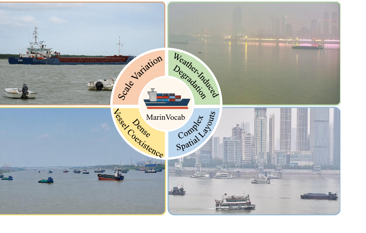
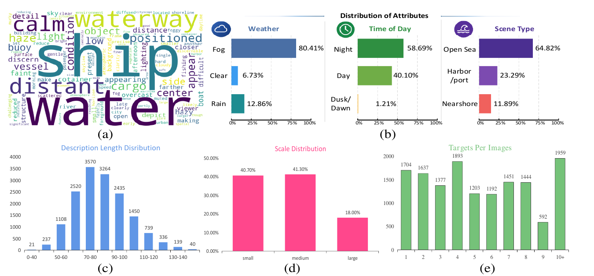
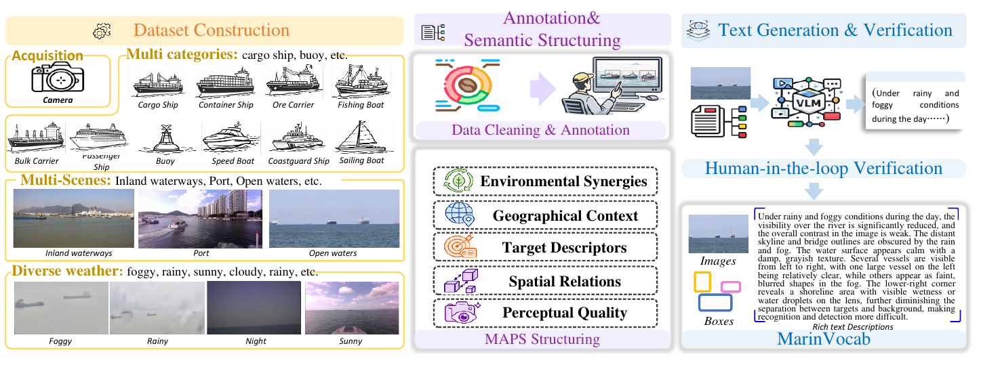

# MarinVocab

### A Diagnostic Benchmark for Maritime Open-Vocabulary Surface-Target Detection

**MarinVocab** is a diagnostic benchmark for maritime open-vocabulary surface-target detection in complex waterborne transportation scenarios. It provides object-level bounding-box annotations, fixed base/novel category splits, structured diagnostic labels, and condition-wise evaluation protocols.

## Overview

Maritime perception systems must operate in open environments where previously unseen vessels and waterborne objects may appear after deployment. Their performance is further affected by fog, rain, nighttime illumination, sea-surface reflection, scale variation, dense vessel coexistence, occlusion, and complex spatial layouts.

Most existing maritime detection datasets mainly provide category labels and bounding boxes. They are suitable for measuring overall detection accuracy, but provide limited support for understanding **why** a detector fails. MarinVocab extends conventional box-level evaluation with structured annotations that enable failure analysis across:

- base and novel categories;
- environmental degradation;
- geographical context;
- perceptual quality;
- target scale and density;
- spatial relations and scene layout.

The benchmark is designed for research on maritime open-vocabulary detection, zero-shot generalization, weak-target perception, and robustness diagnosis in intelligent waterborne transportation.

## Dataset at a Glance

| Item | MarinVocab |
|---|---:|
| Images | **19,787** |
| Annotated instances | **approximately 100,000** |
| Surface-target categories | **10** |
| Base / novel categories | **6 / 4** |
| Training images | **15,830** |
| Validation images | **1,979** |
| Test images | **1,978** |
| Object annotation | Bounding boxes |
| Structured diagnostic dimensions | **5** |
| Evaluation protocols | ZSD and GZSD |
| Main diagnostic factors | Weather, illumination, visibility, scale, density, layout, perceptual quality |

### Comparison with representative maritime datasets

| Dataset | Images | Categories | Instances | BBox | Environmental attributes | Spatial relations | Structured fields | OVD protocol |
|---|---:|---:|---:|:---:|:---:|:---:|:---:|:---:|
| SeaShips | 7K | 6 | 45K | ✓ | – | – | – | – |
| McShips | 10K | 7 | 63K | ✓ | – | – | – | – |
| WSODD | 7.4K | 14 | 18K | ✓ | – | – | – | – |
| MEIWVD | 32.5K | 4 | 190K | ✓ | ✓ | – | – | – |
| **MarinVocab** | **19.8K** | **10** | **100K** | **✓** | **✓** | **✓** | **✓** | **✓** |

## Dataset Characteristics

MarinVocab emphasizes difficult operational conditions rather than clean and well-separated vessel imagery.

| Diagnostic aspect | Distribution |
|---|---|
| Weather | Fog **80.41%**, rain **12.86%**, clear **6.73%** |
| Time of day | Night **58.69%**, day **40.10%**, dusk/dawn **1.21%** |
| Scene type | Open sea **64.82%**, harbor/port **23.29%**, nearshore **11.89%** |
| Target scale | Small **40.70%**, medium **41.30%**, large **18.00%** |
| Dense scenes | **1,959** images contain more than 10 targets |

These distributions create a challenging benchmark characterized by:

- degraded visibility and low image contrast;
- a high proportion of nighttime and foggy scenes;
- frequent small and medium targets;
- dense vessel distributions;
- limited structural landmarks in open-water scenes;
- difficult target-background separation.

## Categories and Open-Vocabulary Split

MarinVocab uses a fixed split of six base categories and four novel categories.

| Split | Categories |
|---|---|
| **Base categories** | ore carrier, fishing boat, bulk cargo carrier, passenger ship, buoy, speed boat |
| **Novel categories** | cargo ship, container ship, coastguard ship, sailing boat |

Base categories are used for supervised detector training. Novel categories are reserved for evaluating open-vocabulary generalization.

## Structured Diagnostic Annotations

MarinVocab uses the **Multi-Attribute Prompting and Structuring (MAPS)** framework to organize scene information into five diagnostic dimensions.

| Diagnostic dimension | Description | Typical attributes |
|---|---|---|
| **Environmental conditions** | Weather and illumination affecting visual perception | fog, rain, clear weather, daytime, nighttime |
| **Geographical context** | Type of waterborne operating environment | open sea, harbor/port, nearshore, inland waterway |
| **Target descriptors** | Object composition and target-level characteristics | category, count, position, scale, visibility, saliency |
| **Spatial relations** | Relative layout among multiple targets | left/right, front/back, near/far, overlap, dense coexistence |
| **Perceptual quality** | Image quality and recognition difficulty | blur, contrast, reflection, occlusion, low visibility |

Structured annotations are generated under schema-constrained vision-language prompting and subsequently checked through human verification and rule-based consistency control.

For validation and test images, structured descriptions are intended for **post-hoc diagnostic analysis** and are not provided to a detector during inference. This prevents per-image textual information from becoming an evaluation-time oracle.

## Dataset Construction

The construction pipeline consists of the following stages:

1. **Multi-source image collection** covering inland waterways, ports, nearshore areas, and open waters under diverse weather and illumination conditions.
2. **Data cleaning and harmonization**, including duplicate removal, category unification, and annotation-format conversion.
3. **Bounding-box verification** to improve object-level annotation consistency.
4. **MAPS semantic structuring** across environmental conditions, geographical context, target descriptors, spatial relations, and perceptual quality.
5. **Vision-language-assisted extraction** using schema-constrained prompts.
6. **Human-in-the-loop verification** and rule-based quality control to reduce hallucinations and annotation inconsistencies.
7. **Leakage-safe processing** to ensure that diagnostic annotations do not provide unavailable per-image information during evaluation-time inference.

## Evaluation Protocols

### Zero-Shot Detection (ZSD)

Only novel categories are evaluated. The protocol measures the detector's ability to recognize categories that are not used as labeled training categories.

### Generalized Zero-Shot Detection (GZSD)

Base and novel categories are evaluated together. In addition to reporting base-category and novel-category performance, MarinVocab uses their harmonic mean to assess the balance between retaining known-category accuracy and transferring to unseen categories.

### Condition-wise diagnostic evaluation

Beyond aggregate mAP and Recall, MarinVocab supports stratified analysis according to:

- weather and visibility;
- time of day and illumination;
- target scale;
- target density;
- scene type;
- spatial layout complexity;
- perceptual quality.

This enables researchers to distinguish category-generalization failures from failures caused by degraded visual conditions or insufficient target coverage.

## Dataset Availability

A **partial release** of MarinVocab is currently available:

- **Download:** https://pan.baidu.com/s/1J6JjY0c0gZjWGAuwwCaKww
- **Password:** `b1ah`

The complete MarinVocab dataset will be released after the formal publication of the associated paper

For research collaboration, please contact the corresponding author.

## Intended Research Use

MarinVocab is intended to support research on:

- maritime open-vocabulary object detection;
- zero-shot and generalized zero-shot detection;
- robustness under fog, rain, nighttime, reflection, and low visibility;
- small, distant, occluded, and low-saliency target detection;
- dense-vessel and complex-layout perception;
- diagnostic evaluation of vision-language detectors;
- safety-critical perception for intelligent waterborne transportation.
